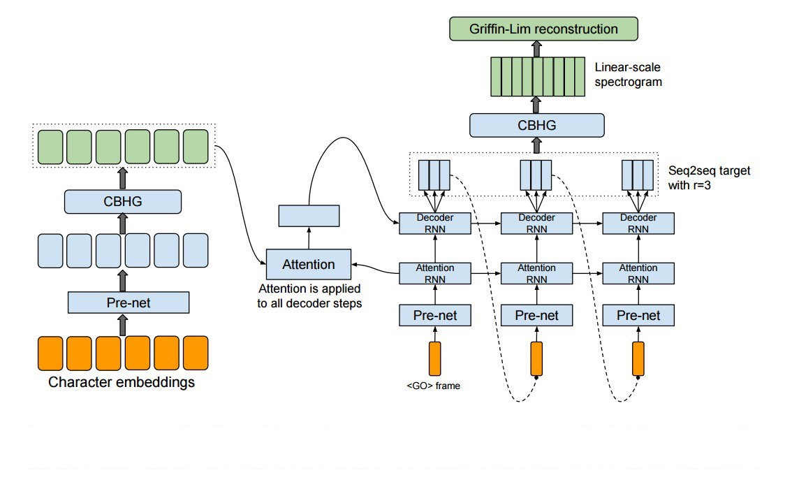

# A Pytorch Implementation of Tacotron: End-to-end Text-to-speech Deep-Learning Model
Implement google's [Tacotron](https://arxiv.org/abs/1703.10135) TTS system with pytorch.  


## Requirements
* python3  
* pytorch  
* librosa  
* numpy  
* pandas  
* scipy  
* matplotlib  


## Usage

* Data  
Download [LJSpeech](https://keithito.com/LJ-Speech-Dataset/) provided by keithito. It contains 13100 short audio clips of a single speaker. The total length is approximately 20 hrs.

* Set config.    
```python
# Set the 'meta_path' and 'wav_dir' in `hyperparams.py` to paths of your downloaded LJSpeech's meta file and wav directory.
meta_path = 'Data/LJSpeech-1.1/metadata.csv'
wav_dir = 'Data/LJSpeech-1.1/wavs'
```

* Train
```bash
# If you have pretrained model, add --ckpt <ckpt_path>
$ python main.py --train --cuda
```

* Evaluate 
```bash
# You can change the evaluation texts in `hyperparams.py`
$ python main.py --eval --cuda --ckpt <ckpt_timestep.pth.tar>
```

## Samples
The sample texts is based on [Harvard Sentences](http://www.cs.columbia.edu/~hgs/audio/harvard.html). See the samples at `samples/` which are generated after training 200k.

## Alignment
The model starts learning something at 30k.


## Differences from the original Tacotron
1. Data bucketing (Original Tacotron used loss mask)
2. Remove residual connection in decoder_CBHG
3. Batch size is set to 8
4. Gradient clipping


## Refenrence
1. (Tensorflow) Kyubyong's  [implementation](https://github.com/Kyubyong/tacotron)
2. (Tensorflow) acetylSv's  [implementation](https://github.com/acetylSv/GST-tacotron)
3. (Pytorch)    soobinseo's [implementaition](https://github.com/soobinseo/Tacotron-pytorch)  

Finally, I have to say this work is highly based on Kyubyong's work, so if you are a tensorflow user, you may want to see his work. Also, feel free to give some feedbacks!
